### I build the tech behind startups, before they have a tech team.

I'm the founding engineer at **Mesa Startup Lab**, the incubator inside Mesa School of Business. When a founder walks in with an idea, I'm the one who turns it into a product: the architecture, the AI, the backend, the app and the deploy, usually solo and usually fast.

That has meant taking an ed-tech startup's operations off spreadsheets so its founders could focus on selling (**monthly revenue went from ₹7–8L to ₹45–50L**), building an ad-tech product end to end ahead of its **₹40L pre-seed**, and replacing the school's Moodle with an LMS I wrote from scratch for **1,000+ students and faculty**.

Right now I'm deep in **agentic AI that's safe to run in production**: agents that answer questions from live data without being able to break it, and a kit that lets non-technical founders ship real products with AI coding agents.

  

## How I work

<table>
<tr>
<td width="50%" valign="top">

**🚀 Ship first, polish with users.** 
A working product in front of real people beats a perfect plan. Feedback decides what gets built next.

</td>
<td width="50%" valign="top">

**🧱 Boring foundations, ambitious features.** 
Typed data, validated APIs and tests underneath, so the AI on top can be bold without being fragile.

</td>
</tr>
<tr></tr>
<tr>
<td width="50%" valign="top">

**💸 AI where it earns its cost.** 
Cheap models do the bulk of the work; frontier models only step in when they change the answer.

</td>
<td width="50%" valign="top">

**⚙️ Automate the ops, free the founders.** 
Every manual spreadsheet is a feature waiting to be built, and founder time belongs to customers.

</td>
</tr>
</table>

## Under the hood

  

  

## Activity

  

<picture>
  <source media="(prefers-color-scheme: dark)" srcset="profile/snake-dark.svg" />
  <source media="(prefers-color-scheme: light)" srcset="profile/snake.svg" />
  
</picture>

**Have an idea that needs to become a product?** [Let's talk →](mailto:gauravmadan2004@gmail.com)

